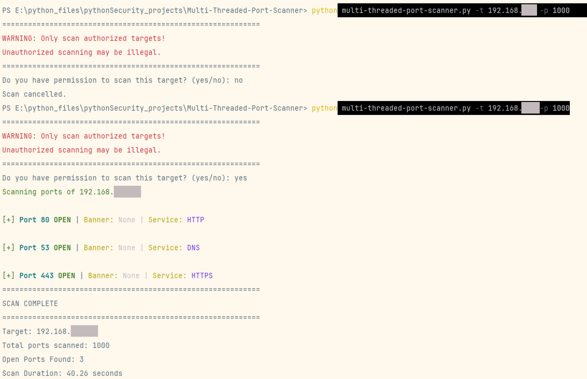

# Multi-Threaded Port Scanner

A Python-based network security tool for scanning TCP ports on target hosts using concurrent threading for fast performance.

⚠️ **Legal Warning**: Only scan systems you own or have explicit written permission to test. Unauthorized port scanning may be illegal in your jurisdiction.

## Demo

Here's what the scanner looks like in action (local network example - all IPs anonymized):



*All targets scanned with explicit permission. Never scan networks you don't own or aren't authorized to test!*

## Features

- ✅ Multi-threaded scanning (50 concurrent connections)
- ✅ Service identification for common ports
- ✅ Banner grabbing for open ports
- ✅ Color-coded output for readability
- ✅ Scan duration tracking
- ✅ Legal disclaimer and consent prompt
- ✅ Detailed error handling

## Installation

1. Clone the repository:
```bash
git clone https://github.com/N-Nilashan/multi-threaded-port-scanner.git
cd multi-threaded-port-scanner
```

2. Install dependencies:
```bash
pip install colorama
```

## Requirements
- Python 3.6+
- colorama library

## Usage

### Basic scan (first 1000 ports):
```bash
python multi-threaded-port-scanner.py -t 192.168.1.1 -p 1000
```

### Scan specific number of ports:
```bash
python multi-threaded-port-scanner.py -t scanme.nmap.org -p 100
```

### Example Output:
```
=================================================================
WARNING: Only scan authorized targets!
Unauthorized scanning may be illegal.
=================================================================
Do you have permission to scan this target? (yes/no): yes
Scanning ports of 192.168.1.1

[+] Port 22 OPEN | Banner: SSH-2.0-OpenSSH_8.2 | Service: SSH
[+] Port 80 OPEN | Banner: None | Service: HTTP
[+] Port 443 OPEN | Banner: None | Service: HTTPS

=================================================================
SCAN COMPLETE
=================================================================
Target: 192.168.1.1
Total ports scanned: 1000
Open Ports Found: 3
Scan Duration: 45.23 seconds
```

## Legal Testing Targets

These hosts explicitly allow port scanning for educational purposes:

- **scanme.nmap.org** - Official Nmap test server
- **localhost / 127.0.0.1** - Your own machine
- **Your home network** - With router access

**NEVER scan:**
- Government websites
- Financial institutions
- Your workplace/university network (without written permission)
- Any system you don't own

## Technical Implementation

- **Threading**: Uses `concurrent.futures.ThreadPoolExecutor` with 50 workers
- **Socket Operations**: TCP connect with 2-second timeout
- **Error Handling**: Specific exception handling for different failure modes
- **Service Detection**: Heuristic-based mapping of common ports
- **Banner Grabbing**: HTTP-style probes for service version detection

## Known Limitations

- Banner grabbing primarily works for HTTP services
- Service identification is heuristic (not always accurate)
- No UDP scanning support
- No stealth/SYN scanning (requires raw sockets/root)
- Fixed thread pool size (50 workers)

## Roadmap

- [ ] Port range support (e.g., `-p 20-80`)
- [ ] Common ports quick-scan mode
- [ ] Output to JSON/CSV file
- [ ] Configurable timeout values
- [ ] Better banner grabbing for non-HTTP services
- [ ] Progress bar for long scans

## This project demonstrates:
- Python socket programming
- Concurrent/parallel execution with ThreadPoolExecutor
- Network security fundamentals
- TCP/IP port scanning techniques

## Author

**Nimesh Nilashan**  
IT Student @ SLIIT | Cybersecurity Specialization  
[LinkedIn](https://linkedin.com/in/nimesh-nilashan) | [GitHub](https://github.com/N-Nilashan)

## License

This project is for educational purposes only. Use responsibly and ethically.
